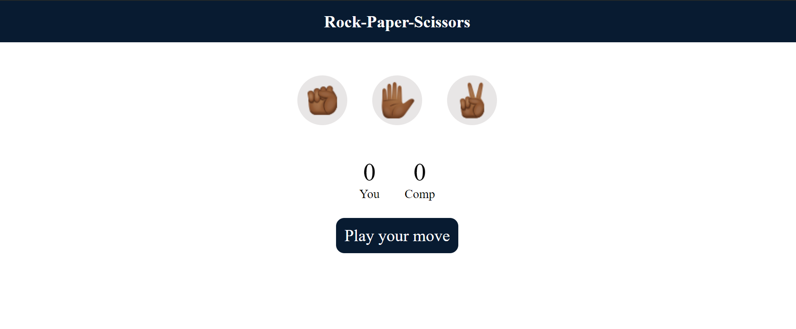
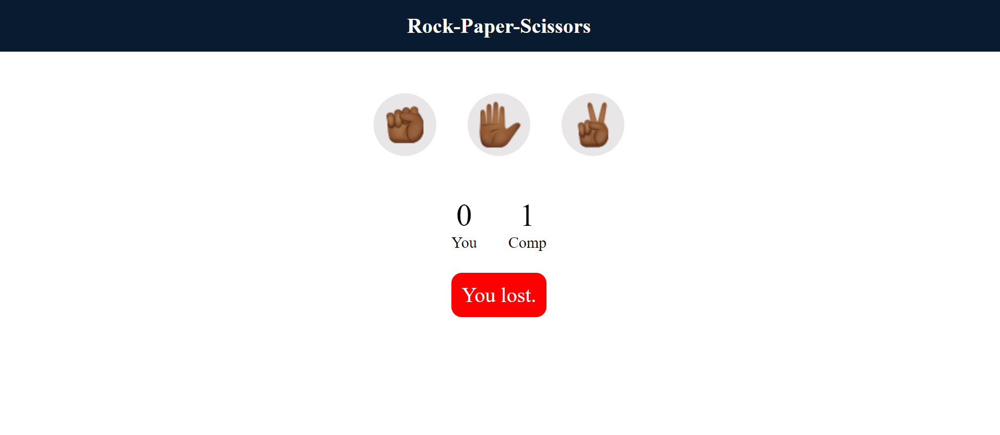

# Rock Paper Scissors Game

This project is a simple implementation of the classic Rock Paper Scissors game using HTML, CSS, and JavaScript. The game allows the user to play against the computer and includes basic game logic, user interface, and styling.

## Features

- Play against the computer
- Responsive design
- Simple and intuitive user interface

## Technologies Used

- **HTML**: Structure of the game
- **CSS**: Styling and layout
- **JavaScript**: Game logic and interactivity

## How to Play

1. Choose Rock, Paper, or Scissors by clicking on the respective button.
2. The computer will make its choice.
3. The result will be displayed: Win, Lose, or Draw.

## Installation

1. Clone the repository:
    ```bash
    git clone https://github.com/VaibhaviSawant101/RockPaperScissors.git
    ```
2. Navigate to the project directory:
    ```bash
    cd RockPaperScissors
    ```
3. Open `index.html` in your browser to play the game.

## Screenshots






